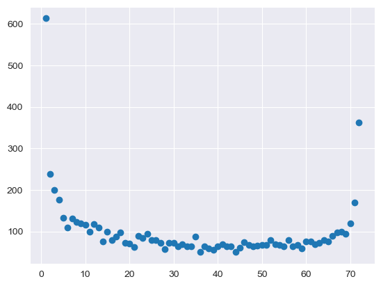
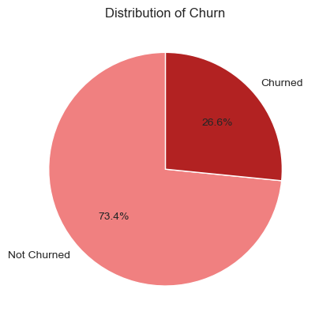

<h1 align="center"> Customer Churn Predictor </h1>
<p align="center"> 
   
   
   
   
   
   
   
</p>
<h3 align="center"> End to End Data Science Project: "Predicing Customer Churn in a Telecommunication Company"</h3>

<br>

# 📌 Overview
The Product Search Agent is an AI-powered web application that allows users to search for product details, including price comparisons, from multiple online sources. It leverages various agentic tools and Large Language Models (LLMs) to fetch, analyze, and present product information.

<br>

# 🧱 About the project:
   - Developed a machine learning model to predict whether a customer of a telecommunication company will churn.
   - Followed a modular structure for the entire project. 
   - Utilized data of over 7000 records to train and develop the model.
   - Cleaned and preprocessed the raw data.
   - Performed feature transformation, scaled the numerical features and handled imbalance in the dataset.
   - Trained the model using various ML algorithms and selected the best one with higher accuracy.
   - Deployed the model using a Flask web application for real-time predictions.

<br>

## 1. Data Collection:
   - Utilized the company's historical data of over 7000 records which includes information such as demographic details, services subscribed and account information.
   - For each customer the following information is available:
      - Gender
      - Senior Citizen
      - Partner
      - Dependents
      - Tenure
      - Phone Service
      - Multiple Lines
      - Internet Service
      - Online Security
      - Online Backup
      - Device Protection
      - Tech Support
      - Streaming TV
      - Streaming Movies
      - Contract Type
      - Paperless Billing
      - Payment Method
      - Monthly Charges
      - Total Charges

## 2. Data Cleaning & preprocessing:
   - Cleaned and preprocessed the raw data:
      * Handled missing values. 
      * Removed duplicate records.
      * Removed outliers using zscore to avoid overfitting.
      * Replaced boolean values with numerical values.
      * Converted the values of tenure column in to bin values with a range of 12 months to ensure effective information understanding.

## 3. Exploratory Data Analysis and Feature Engineering:
   - Once the data is cleaned and preprocessed I analyzed the data to identify hidden patterns, relationships between features.
   - Implemented both single and cross feature analysis to find relationships betweent features.
   - Analyzed and visualized each feature to understand its values and the value counts to determine its overall importance.
   - Some of the major findings:
      * Among the entire customer base around 16% of them are senior citizens.
      * Customers who are more likely to churn have lower monthly and total charges.
      * Senior citizen customer have higher churn rates than non senior citizen customers.
      * The longer a customer stays with the business, the lower the chances of churning.
      * Customers with a tenure of within 1 years have equal chances of both churning and staying in the business.
      * Customers with a contract type of month-to-month have left the business more often.
   - Visualizations:
   - Distribution of tenure:
      - 
       
   - Imbalance in churn:
      - 
       
   - Monthly and Total Charges by churn:
      - 

## 4. Model Building:
   - Used different classification algorithms to train the model.
      * Logistic Regression
      * Naive Bayes
      * Knn Classifier
      * Decision Tree
      * Random Forest
      * Adaboost Classifier
      * Xgboost Classifier
      * Support Vector Classifier
   - Performed hyper parameter tunning using GridSearchCV to optimize and improve the performance models.
   - Evaluated the models with accuracy score and confusion matrix (percision, recall, f1 score) and selected the model with higher accuracy.
   - Out of all the algorithms used, Xgboost classifier had the highest accuracy of 81%.

## 5. Deployment:
   - Developed a Flask web application to deploy the model for real-time predictions.
   - Built both front-end and back-end components for the web app.
   - Created a custom website where users can enter customer data and receive predictions from the model.
   - Deployed the Flask app on local host server for easy access.

<br>

# 📸 Screenshots  
### Home Page  

<br>
### Predict Page

<br>
### Results 


<br>

# 📂 Project Structure
```
/📂Customer-Churn-Project
│── /📂artifacts                     # Csv and pickel files 
│   ├── data_cleaned.csv
│   ├── test.csv
│   ├── train.csv
│   ├── model.pkl
│   ├── preprocessor.pkl         
│── /📂Data
│   ├── data.csv                      # Raw data 
|   ├── data_eda.csv                  # Cleaned, preprocessed data
│── /📂eda_images                     # Images of exploratory analysis
│   ├── tenure.png
|   ├── churn.png
|   ├──charges by churn.png
│── /📂notebook                       # Research ipynb notebook
│── /📂src                            # Source files (core files of the project)
|   ├──exception_handling.py           # custom exception handling
|   ├──logger.py                       # Logging messages
|   ├──utils.py                        # Helper, utilities functions
|   │── /📂components                 # Main components files    
|   |   │── data_cleaning.py         
|   |   │── data_ingestion.py
|   |   │── data_transformation.py
|   │── /📂pipelines                    # Pipeline files
|   |   │── predict_pipeline.py
|   |   │── train_pipeline.py
│── /📂static                         # Static folder
|   │── /📂css                        # Css files 
|   |   │── hp_style.css              # Home page styles
|   |   │── pp_style.css              # Predict page styles
|   │── /📂images                     # Website Images
│── /📂templates                      # Templates (html files)
|   │── /home_page.html
|   │── /predict_page.html
│── /📂logs                           # Log messages
│── .gitignore
│── README.md
│── app.py                            # Flask backend
│── requirements.txt                  # Python dependencies
│── setup.py                          # Setup
```

<br>

# 🚀 Installation & Setup

### 1️⃣ Clone the Repository
```sh
git clone https://github.com/Dhanush-Raj1/Customer-Churn-Project.git
cd Customer-Churn-Project
```

### 2️⃣ Create a Virtual Environment
```sh
conda create -p envi python==3.9 -y
source venv/bin/activate   # On macOS/Linux
conda activate envi     # On Windows
```

### 3️⃣ Install Dependencies
```sh
pip install -r requirements.txt
```

### 4️⃣ Run the Flask App
```sh
python app.py
```

The app will be available at: **http://127.0.0.1:5000/**

<br>


# 🎯 Future Enhancements
- Increased 
- Integration with payment gateways
- Multi-language support

<br>

# 🤝 Contributing  
💡 Have an idea? Feel free to contribute or open an issue and pull requests!  

📄 License
This project is licensed under the MIT License – see the LICENSE file for details.
