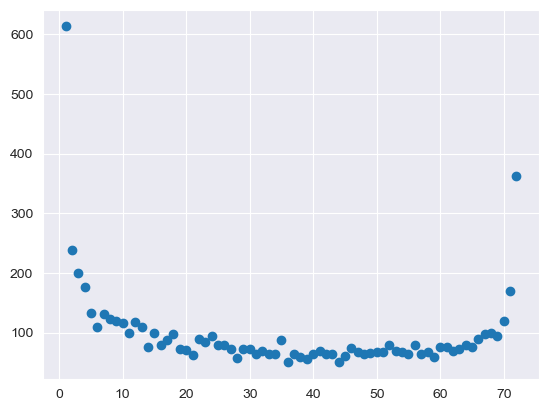
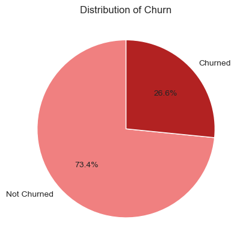

# End to End Data Science Project: "Predicing Customer Churn in a Telecommunication Company"
## Project Overview:
   - Developed a machine learning model to predict whether a customer of a telecommunication company will churn.
   - Followed a modular structure for the entire project. 
   - Utilized historical data of over 7000 records to train and develop the model.
   - Cleaned and preprocessed the raw data.
   - Performed feature transformation, scaled the numerical features and handled imbalance in the dataset.
   - Trained the model using various ML algorithms and selected the best one with higher accuracy.
   - Deployed the model using a Flask web application for real-time predictions.

## 1. Data Collection:
   - Utilized the company's historical data of over 7000 records which includes information such as demographic details, services subscribed and account information.
   - For each customer the following information is available:
      - Gender
      - Senior Citizen
      - Partner
      - Dependents
      - Tenure
      - Phone Service
      - Multiple Lines
      - Internet Service
      - Online Security
      - Online Backup
      - Device Protection
      - Tech Support
      - Streaming TV
      - Streaming Movies
      - Contract Type
      - Paperless Billing
      - Payment Method
      - Monthly Charges
      - Total Charges

## 2. Data Cleaning & preprocessing:
   - Cleaned and preprocessed the raw data:
      * Handled missing values. 
      * Removed duplicate records.
      * Removed outliers using zscore to avoid overfitting.
      * Replaced boolean values with numerical values.
      * Converted the values of tenure column in to bin values with a range of 12 months to ensure effective information understanding.

## 3. Exploratory Data Analysis and Feature Engineering:
   - Once the data is cleaned and preprocessed I analyzed the data to identify hidden patterns, relationships between features.
   - Implemented both single and cross feature analysis to find relationships betweent features.
   - Analyzed and visualized each feature to understand its values and the value counts to determine its overall importance.
   - Some of the major findings:
      * Among the entire customer base around 16% of them are senior citizens.
      * Customers who are more likely to churn have lower monthly and total charges.
      * Senior citizen customer have higher churn rates than non senior citizen customers.
      * The longer a customer stays with the business, the lower the chances of churning.
      * Customers with a tenure of within 1 years have equal chances of both churning and staying in the business.
      * Customers with a contract type of month-to-month have left the business more often.
   - Visualizations:
   - Distribution of tenure:
      - 
   - Imbalance in churn:
      - 
      
   - Monthly and Total Charges by churn:
      - 

## 4. Model Building:
   - Used different classification algorithms to train the model.
      * Logistic Regression
      * Naive Bayes
      * Knn Classifier
      * Decision Tree
      * Random Forest
      * Adaboost Classifier
      * Xgboost Classifier
      * Support Vector Classifier
   - Performed hyper parameter tunning using GridSearchCV to optimize and improve the performance models.
   - Evaluated the models with accuracy score and confusion matrix (percision, recall, f1 score) and selected the model with higher accuracy.
   - Out of all the algorithms used, Xgboost classifier had the highest accuracy of 81%.

## 5. Deployment:
   - Developed a Flask web application to deploy the model for real-time predictions.
   - Built both front-end and back-end components for the web app.
   - Created a custom website where users can enter customer data and receive predictions from the model.
   - Deployed the Flask app on local host server for easy access.
