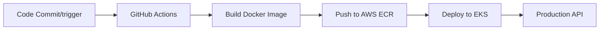
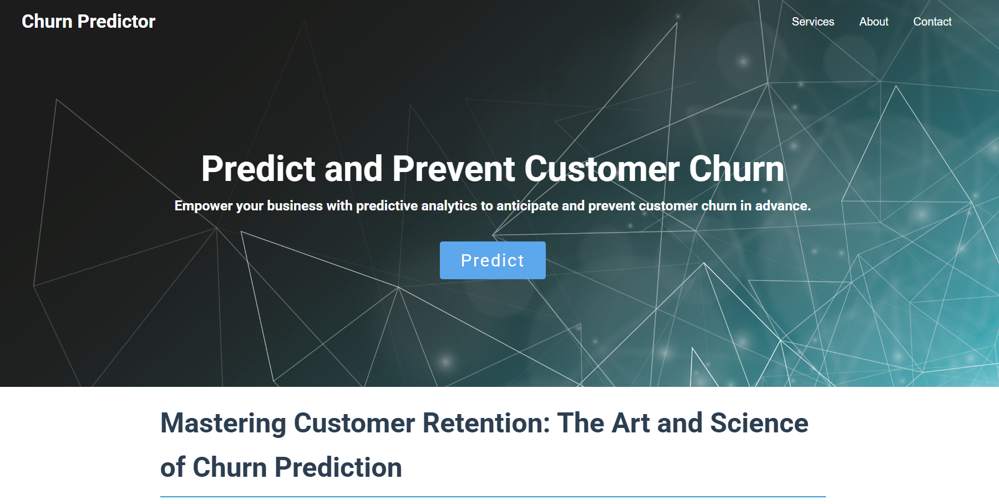
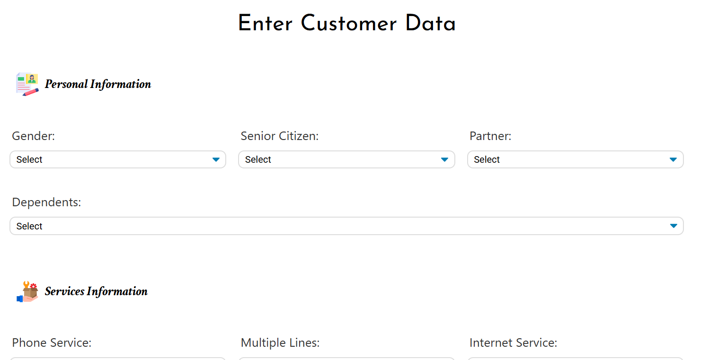
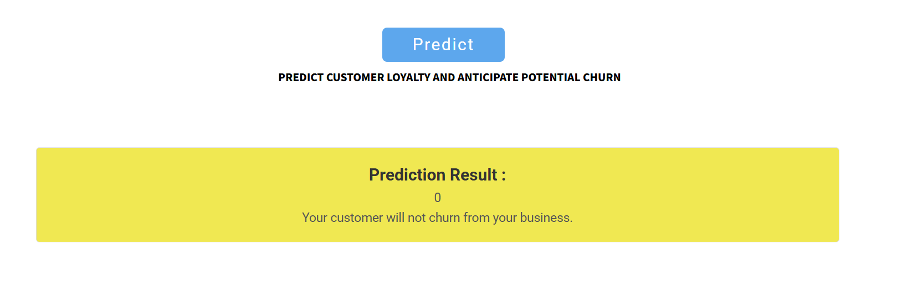

<h1 align="center"> Customer Churn Predictor </h1>
<p align="center"> 
   
   
   
   
   
   
   
   
</p>
<h3 align="center"> End to End MLOps Data Science Project: Predicting Customer Churn in a Telecom Company</h3>
<h3 align="center"> Deployed to AWS EKS with Github Actions CI/CD </h3>

<br>

# 📌 Churn Predictor  
Customer churn represents the percentage of users discontinuing service within a given period. This project builds a machine learning pipeline to **predict customer churn** in a telecom business using historical data and deploys the model as a **Flask web app** with **CI/CD integration** using **GitHub Actions** and **AWS EKS** for scalable production.

<br>

# 🧱 Project Overview 
   - Developed a machine learning model to predict whether a customer of a telecommunication company will churn.
   - Followed a modular structure for the entire project. 
   - Utilized data of over 7000 records to train and develop the model.
   - Cleaned and preprocessed the raw data.
   - Performed feature transformation, scaled the numerical features and handled imbalance in the dataset.
   - Trained the model using various ML algorithms and selected the best one with higher accuracy.
   - Deployed the model using a Flask web application for real-time predictions.
   -  Integrated **CI/CD automation** using **GitHub Actions** to build, test, containerize, and deploy the application to **AWS EKS (Elastic Kubernetes Service)** on every code update.

<br>

# 📌 Project Workflow
## 1. Data Collection:
   - Utilized the company's historical data of over 7000 records which includes information such as demographic details, services subscribed and account information.
   - For each customer the following information is available:
      - Gender
      - Senior Citizen
      - Partner
      - Dependents
      - Tenure
      - Phone Service
      - Multiple Lines
      - Internet Service
      - Online Security
      - Online Backup
      - Device Protection
      - Tech Support
      - Streaming TV
      - Streaming Movies
      - Contract Type
      - Paperless Billing
      - Payment Method
      - Monthly Charges
      - Total Charges

## 2. Data Cleaning & preprocessing:
   - Cleaned and preprocessed the raw data:
      * Handled missing values. 
      * Removed duplicate records.
      * Removed outliers using zscore to avoid overfitting.
      * Replaced boolean values with numerical values.
      * Converted the values of tenure column in to bin values with a range of 12 months to ensure effective information understanding.

## 3. Exploratory Data Analysis and Feature Engineering:
   - Once the data is cleaned and preprocessed I analyzed the data to identify hidden patterns, relationships between features.
   - Implemented both single and cross feature analysis to find relationships betweent features.
   - Analyzed and visualized each feature to understand its values and the value counts to determine its overall importance.
   - Some of the major findings:
      * Among the entire customer base around 16% of them are senior citizens.
      * Customers who are more likely to churn have lower monthly and total charges.
      * Senior citizen customer have higher churn rates than non senior citizen customers.
      * The longer a customer stays with the business, the lower the chances of churning.
      * Customers with a tenure of within 1 years have equal chances of both churning and staying in the business.
      * Customers with a contract type of month-to-month have left the business more often.
   - Visualizations:
   - Distribution of tenure:  
      -   
       
   - Imbalance in churn:  
      -   
       
   - Monthly and Total Charges by churn:  
      -   

## 4. Model Building:
   - Used different classification algorithms to train the model.
      * Logistic Regression
      * Naive Bayes
      * Knn Classifier
      * Decision Tree
      * Random Forest
      * Adaboost Classifier
      * Xgboost Classifier
      * Support Vector Classifier
   - Performed hyper parameter tunning using GridSearchCV to optimize and improve the performance models.
   - Evaluated the models with accuracy score and confusion matrix (percision, recall, f1 score) and selected the model with higher accuracy.
   - Out of all the algorithms used, Xgboost classifier had the highest accuracy of 81%.

## 5. Deployment:
   - Developed a Flask web application to deploy the model for real-time predictions.
   - Built both front-end and back-end components for the web app.
   - Created a custom website where users can enter customer data and receive predictions from the model.
   - Deployed the Flask app on local host server for easy access.

## 6. CI/CD Automation with GitHub Actions & AWS EKS:
   - Implemented an end-to-end continuous integration and deployment pipeline using **GitHub Actions**.
   - The pipeline performs the following steps:
      * Runs tests (unit test) on our web application using **pytest** to ensure the application is working as expected.
      * Builds a Docker image of the application and pushes it to **Amazon Elastic Container Registry (ECR)**.
      * Updates the Kubernetes manifests with the latest image and deploys the application to **Amazon EKS**.
      * Verifies deployment health by checking pod and service status.

<br>

## 🚀 Key Features
- **ML Pipeline**: Data preprocessing, feature engineering, and XGBoost modeling
- **Web Interface**: Flask-based prediction interface
- **CI/CD Automation**: GitHub Actions pipeline for testing, Dockerization, and deployment
- **Cloud Deployment**: Kubernetes-managed scalable infrastructure on AWS EKS
- **Modular Codebase**: Production-ready Python implementation

<br>

## 🌐 Deployment Architecture


<br>

# 🛠 Tech Stack
| Technology | Description |
|------------|-------------|
| **Python** | Programming language used  |
| **Flask** | Web framework for UI and API integration |
| **HTML & CSS** | Frontend design and styling |
| **Pandas** | Cleaning and preprocessing the data |
| **Numpy** | Performing numerical operations |
| **Matplotlib** | Visualization of the data |
| **GitHub Actions** | Automates build, test, and deployment pipelines |
| **Docker** | Containerization of the application |
| **Amazon ECR** | Docker image registry for container storage |
| **Amazon EKS** | Managed Kubernetes service for production deployment |
| **Kubernetes** | Orchestration platform for scalable deployment |

<br>

# 📂 Project Structure
```
/📂Customer-Churn-Project
│── /📂.github                        # GitHub Actions CI/CD workflow
│   └── /📂workflows
│
│── /📂k8s                            # Kubernetes deployment manifests
│   ├── deployment.yaml
│   └── service.yaml
│
│── /📂artifacts                     # Model artifacts and intermediate data
│
│── /📂data                          # Raw and EDA-processed data
│
│── /📂eda_images                    # Visualizations for EDA
│
│── /📂notebook                      # Jupyter notebooks for experimentation
│
│── /📂src                           # Source code (modular ML pipeline)
│   ├── /📂components                # Individual pipeline components
│   └── /📂pipelines                 # Training and prediction pipelines
│
│── /📂static                        # Static assets for the web app
│   ├── /📂css
│   └── /📂images
│
│── /📂templates                     # HTML templates for the Flask frontend
│
│── .dockerignore                    # Ignore rules for Docker build
│── Dockerfile                       # Docker image definition
│── test_app.py                      # Unit tests for app functionality
│── .gitignore                       # Git ignore rules
│── README.md                        # Project documentation
│── app.py                           # Flask backend app
│── requirements.txt                 # Python dependency list
│── setup.py                         # Setup script for packaging

```

<br>

# 🚀 Installation & Setup

### 1️⃣ Clone the Repository
```sh
git clone https://github.com/Dhanush-Raj1/Customer-Churn-Project.git
cd Customer-Churn-Project
```

### 2️⃣ Create a Virtual Environment
```sh
conda create -p envi python==3.9 -y
source venv/bin/activate   # On macOS/Linux
conda activate envi     # On Windows
```

### 3️⃣ Install Dependencies
```sh
pip install -r requirements.txt
```

### 4️⃣ Run the Flask App
```sh
python app.py
```

The app will be available at: **http://127.0.0.1:5000/**

<br>

# 🌐 Usage Guide    
1️⃣ Open the web app in your browser.    
2️⃣ Click the predict on the home page of the web app.  
3️⃣ Enter the customer details in the respective dropdowns.   
4️⃣ Click the predit button and the predicted results will appear.  

<br>

# 📸 Screenshots  
### 🟠 Home Page  


<br>

### 🔵 Predict Page


<br>

### 🟢 Results 


<br>

# 🎯 Future Enhancements
✅ Improved accuracy of the model with advanced fine tunning  
✅ Real-Time Prediction System  
✅ Automated Retraining Pipeline  
✅ Improve UI with a more interactive design.    
✅ Customer Retention Strategy Recommender.  
✅ Anomaly Detection for Unexpected Churn

<br>

# 🤝 Contributing  
💡 Contributions, issues, and pull requests are welcome! Feel free to open an issue or submit a PR to improve this project. 🚀 

<br>

# 📄 License  
This project is licensed under the MIT License – [LICENSE](LICENSE)
